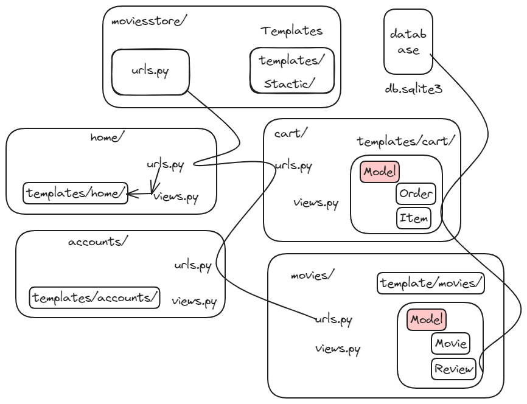

# Django Movies Store Project
> [!NOTE]
> 
> Overview project:

[](https://www.youtube.com/watch?v=ffB0r0ee_Zo)


The project was developed using Django (Python), with a SQLite database and Bootstrap (a CSS framework).
**Core Features:**
* The Home page features a welcoming message.
* The About page provides details about the Movie Store.
* The Movies page exhibit information on available movies and include a filter to search movies by name. Additionally, users can click on a specific movie to view details and post reviews.
* The Cart page showcase the movies added to the cart, along with the total price to be paid. User can also remove movies from the cart and proceed with purchase.
* The Register page present a form enabling users to sign up for accounts.
* The Login page present a form allowing users to log in to the applications.
* The Orders page display the orders placed by the logged-in users.
* The Admin paned encompass sections to manage the store's information, including creating, updating, deleting, and listing information.

## Directory Structure 
**Architecture and Structure**



```
├───accounts
│   ├───migrations
│   └───templates
│       └───accounts
├───cart
│   ├───migrations
│   ├───templates
│   │   └───cart
│   └───templatetags
├───home
│   ├───migrations
│   ├───static
│   │   ├───css
│   │   └───img
│   └───templates
│       └───home
├───media
│   └───movie_image
├───movies
│   ├───migrations
│   ├───static
│   │   └───css
│   └───templates
│       └───movies
├───moviesstore
```

<!-- 
## Deployment

## Security 

## Testing 

## Performance and Optimization

## Challenges and Lessons Learned -->

## References 
- Django 5 for the Impatient 